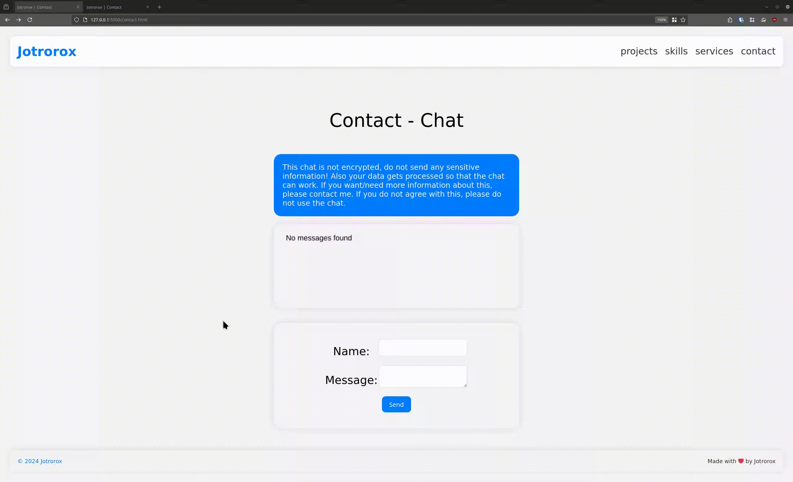

<div align="center" id="top"> 
  <!--  -->

  &#xa0;

  <!-- <a href="https://html_only_chat.netlify.app">Demo</a> -->
</div>

<h1 align="center">HTML Only Chat</h1>

<p align="center">
  

  

  

  

   

   

   
</p>

<!-- Status -->

<h4 align="center"> 
	🚧  HTML Only Chat 🚀 Under construction (Proof of Concept) ...  🚧
</h4> 

<hr>

<p align="center">
  <a href="#dart-about">About</a> &#xa0; | &#xa0; 
  <a href="#sparkles-features">Features</a> &#xa0; | &#xa0;
  <a href="#rocket-technologies">Technologies</a> &#xa0; | &#xa0;
  <a href="#white_check_mark-requirements">Requirements</a> &#xa0; | &#xa0;
  <a href="#checkered_flag-starting">Starting</a> &#xa0; | &#xa0;
  <a href="#memo-license">License</a> &#xa0; | &#xa0;
  <a href="https://github.com/jotrorox" target="_blank">Author</a>
</p>

<br>

## :dart: About ##

A simple proof of concept app simply made to test the creation of a chat room without using any programming language on the client. It is not made for production use but only to prove a point to my CS teacher.

## :sparkles: Features ##

:heavy_check_mark: Send Messages\
:heavy_check_mark: Saving Messages in a DB\
:heavy_check_mark: Rendered Chat output

## :rocket: Technologies ##

The following tools were used in this project:

- [Node.js](https://nodejs.org/en/)
- [Express.js](https://expressjs.com/)
- [SQLite](https://www.sqlite.org/)
- [Sharp](https://sharp.pixelplumbing.com/)
- [Mocha](https://mochajs.org/)

## :white_check_mark: Requirements ##

Before starting :checkered_flag:, you need to have [Git](https://git-scm.com) and [Node](https://nodejs.org/en/) installed.

## :checkered_flag: Starting ##

```bash
# Clone this project
$ git clone https://github.com/Jotrorox/htmlOnlyChat

# Access
$ cd htmlOnlyChat

# Install dependencies
$ npm i

# Run the project in development mode
$ npm run dev

# Run the project in normal mode
$ npm run start
```

## :memo: License ##

This project is under license from AGPL-v.3. For more details, see the [LICENSE](LICENSE) file.


Made with :heart: by <a href="https://jotrorox.com" target="_blank">Jotrorox</a>

&#xa0;

<a href="#top">Back to top</a>
